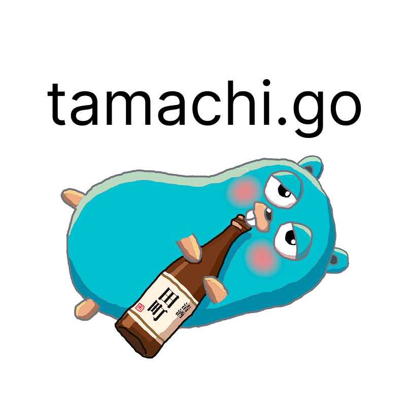

**田町駅から半径約20km(20060102150405nm)の Golang コミュニティ**

---

## 🐹 tamachi.go とは
tamachi.goは田町駅から半径20060102150405nm (約20km) にお住まい・お勤め・ゆかりのあるエンジニアを対象としたgolangの勉強を目的としたコミュニティとなります

golangに関わらずGopherのためになる内容であれば、golangに限らず何でも歓迎です。 
(例: GopherのためのVim活用術など)
普段の業務でやったことや、新しい発見、初めての登壇の機会など、気軽に発表できる場所として、ぜひみんなで育てていければと思っています
---

## 📅 参加方法

最新のイベント情報は connpass で公開しています。

👉 **[tamachi.go on connpass](https://tamachi-go.connpass.com)**

初参加大歓迎です。気になるイベントがあれば気軽にご参加ください。

---

## 🙋 運営メンバー

<table>
  <tr>
    <th>名前</th>
    <th>役割</th>
    <th>Twitter(X)</th>
    <th>GitHub</th>
  </tr>
  <tr>
    <td>なかむら</td>
    <td>主催</td>
    <td></td>
    <td></td>
  </tr>
  <tr>
    <td>パンダム</td>
    <td>主催</td>
    <td></td>
    <td></td>
  </tr>
</table>

> 運営に興味がある方はお気軽にお声がけください！

---

## 🎤 活動実績

| 回 | 日付 | URL|
|----|------|--------|
| #1 | 2026-08-20 | [tamachi.go #1](https://tamachi-go.connpass.com/event/400310/) |

過去のイベント一覧はconnpassの[開催イベント一覧](https://tamachi-go.connpass.com/event/)からご覧いただけます。

---

