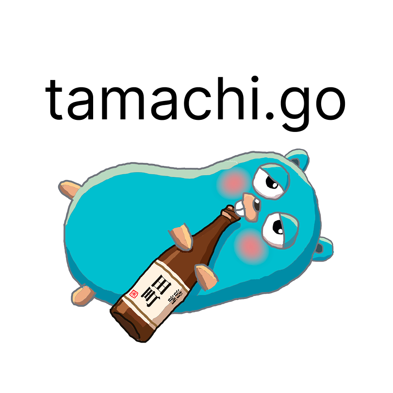

**田町駅から半径約20km(20060102150405nm)の Golang コミュニティ**

## 🐹 tamachi.go とは

tamachi.goは田町駅から半径20060102150405nm (約20km) にお住まい・お勤め・ゆかりのあるエンジニアを対象としたgolangの勉強を目的としたコミュニティとなります。

golangに関わらずGopherのためになる内容であれば、golangに限らず何でも歓迎です。 
(例: GopherのためのVim活用術など) 
普段の業務でやったことや、新しい発見、初めての登壇の機会など、気軽に発表できる場所として、ぜひみんなで育てていければと思っています。

## 📅 参加方法

最新のイベント情報は connpass で公開しています。

👉 **[tamachi.go on connpass](https://tamachi-go.connpass.com)**

初参加大歓迎です。気になるイベントがあれば気軽にご参加ください。

## 🙋 運営メンバー

<table>
  <tr>
    <th>名前</th>
    <th>役割</th>
    <th>Twitter(X)</th>
    <th>GitHub</th>
  </tr>
  <tr>
    <td>なかむら</td>
    <td>主催</td>
    <td></td>
    <td></td>
  </tr>
  <tr>
    <td>パンダム</td>
    <td>主催</td>
    <td></td>
    <td></td>
  </tr>
</table>

> 連絡はTwitter(X)にて！

## 🎤 活動実績

| 回  | 日付       | URL                                                            |
| --- | ---------- | -------------------------------------------------------------- |
| #1  | 2026-08-20 | [tamachi.go #1](https://tamachi-go.connpass.com/event/400310/) |

過去のイベント一覧はconnpassの[開催イベント一覧](https://tamachi-go.connpass.com/event/)からご覧いただけます。

また過去の運営でのスライドは[こちら](https://tamachi-go.github.io/slide/)

## 🛡️ 行動規範・アンチハラスメントポリシー

tamachi.goは、すべての参加者が安心して学び、交流できる場を目指しています。性別、国籍、年齢、経験や技術レベルなどにかかわらず、互いを尊重してご参加ください。参加者の皆さまに [Go Community Code of Conduct](https://go.dev/conduct) の厳守をお願いしております。

差別的・攻撃的な言動、性的な表現、無断での撮影・SNS投稿、執拗な勧誘、技術レベルを見下す言動などのハラスメント行為を禁止します。これは会場だけでなく、懇親会やオンラインでのやり取りにも適用されます。
ハラスメントを受けた・目撃した場合は、運営スタッフまでご相談ください。プライバシーは厳守します。違反があった場合、運営の判断で注意・退場等の対応を行うことがあります。

## 📄 ライセンス表記

- 元になっている Gopher は、[Renée French](https://reneefrench.blogspot.com/) さんによってデザインされ、[CC BY 3.0](https://creativecommons.org/licenses/by/3.0/) ライセンスの下で公開されています。
- このロゴは、Gopher を使って tamachi.go がデザインしました。[CC0](https://creativecommons.org/publicdomain/zero/1.0/deed.ja) ライセンスの下で公開されています。

画像データは [tamachi-go/assets](https://github.com/tamachi-go/assets) で公開しています。
